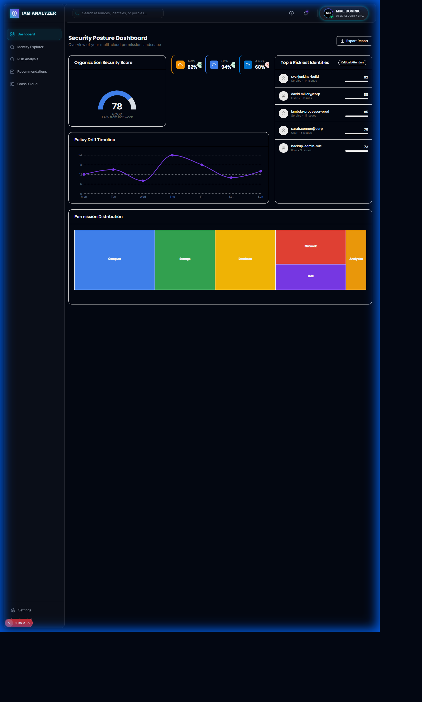
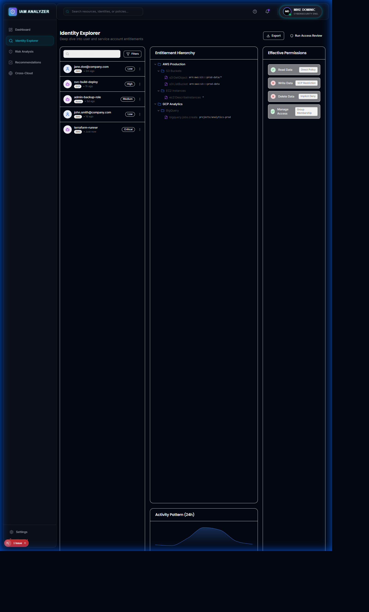
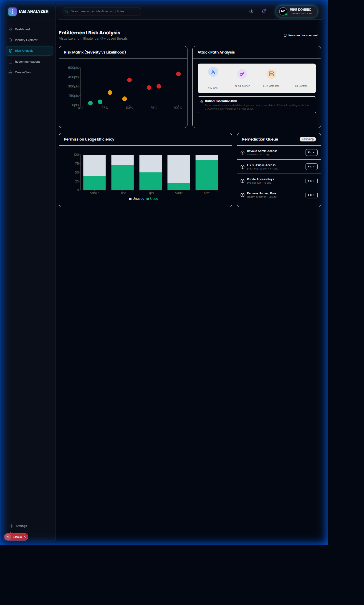

<p align="center">
  
</p>

<h1 align="center">ZeroTrust IAM Analyzer</h1>
<h3 align="center">Multi-Cloud CIEM Platform for Identity Entitlement Management</h3>

<p align="center">
  
  
  
  
  
  
  
  
</p>

<p align="center">
  <strong>Enterprise CIEM solution analyzing cloud entitlements across GCP and AWS with Zero Trust scoring and least-privilege recommendations</strong>
</p>

---

## Key Results & Impact

<table>
<tr>
<td align="center" width="25%">
<h3>847</h3>
<strong>Identities Analyzed</strong>
<br/>Cross-cloud inventory
</td>
<td align="center" width="25%">
<h3>99%</h3>
<strong>Unused Permissions</strong>
<br/>Industry average found
</td>
<td align="center" width="25%">
<h3>70%</h3>
<strong>Role Reduction</strong>
<br/>After remediation
</td>
<td align="center" width="25%">
<h3>15</h3>
<strong>Escalation Paths</strong>
<br/>Detected & blocked
</td>
</tr>
</table>

---

## The Problem

<table>
<tr>
<td width="50%">

### Cloud Permission Sprawl is Out of Control

According to industry research:
- **99%** of cloud permissions granted are never used (Gartner 2024)
- **68%** of cloud breaches involve over-privileged identities
- Organizations use **3-4 cloud providers** with different permission models
- Service accounts outnumber human users **10:1**

Traditional IAM tools cannot:
- Visualize effective permissions across clouds
- Detect privilege escalation paths
- Identify external access exposure
- Calculate least-privilege compliance

</td>
<td width="50%">

### What CIEM Provides

Cloud Infrastructure Entitlement Management (CIEM) enables:
- **Cross-cloud visibility** into all identity permissions
- **Excessive permission detection** at scale
- **Privilege escalation path** identification
- **External access analysis** (public, cross-account)
- **Least-privilege scoring** and recommendations
- **Compliance mapping** (CIS, NIST, PCI-DSS)

**CIEM is foundational for Zero Trust architecture.**

</td>
</tr>
</table>

---

## The Solution: ZeroTrust IAM Analyzer

<p align="center">
  
</p>

ZeroTrust IAM Analyzer provides enterprise-grade CIEM capabilities across **GCP** and **AWS**:

| Capability | Technology | Outcome |
|------------|------------|---------|
| **Identity Discovery** | GCP IAM + AWS IAM | Complete identity inventory |
| **Entitlement Analysis** | Custom analyzers | Map effective permissions |
| **Risk Scoring** | ML-based scoring | 0-100 risk quantification |
| **External Access Detection** | AWS IAM Access Analyzer | Find public/cross-account exposure |
| **Policy Validation** | CIS Benchmark checks | Compliance scoring |
| **Least Privilege** | Permission gap analysis | Remediation recommendations |

---

## Screenshots

### Dashboard Views

<table>
<tr>
<td align="center" width="33%">

<br/><strong>Security Dashboard</strong>
<br/>Real-time CIEM metrics
</td>
<td align="center" width="33%">

<br/><strong>Identity Explorer</strong>
<br/>Cross-cloud identity view
</td>
<td align="center" width="33%">

<br/><strong>Risk Analysis</strong>
<br/>Entitlement risk scoring
<table>
<tr>
<td width="60%">

### The Integration Rationale

AWS IAM Access Analyzer was chosen for v1.1 because:

1. **Native AWS Service** - Deep integration with AWS IAM
2. **External Access Detection** - Finds public and cross-account exposure
3. **Multi-Resource Support** - S3, IAM roles, KMS, Lambda, etc.
4. **boto3 SDK** - Official Python SDK for seamless integration
5. **Compliance Ready** - Maps to CIS AWS Foundations Benchmark

### Skills Demonstrated

- Multi-cloud IAM integration (GCP + AWS)
- boto3 SDK and AWS API expertise
- Policy document parsing and validation
- Compliance framework mapping

</td>
<td width="40%">

### Before vs After

| Metric | v1.0 | v1.1 |
|--------|------|------|
| Cloud Providers | GCP only | GCP + **AWS** |
| Resource Types | 5 | **14+** |
| Compliance | Basic | **CIS, NIST, PCI** |
| External Access | Manual | **Automated** |

### Supported AWS Resources

- S3 Buckets
- IAM Roles
- KMS Keys
- Lambda Functions
- RDS Snapshots
- ECR Repositories
- Secrets Manager
- SNS/SQS

</td>
</tr>
</table>

---

## Architecture

```
                                    CLOUD PROVIDERS
    ┌─────────────────┐    ┌─────────────────┐    ┌─────────────────┐
    │   Google Cloud  │    │      AWS        │    │ Google Workspace│
    │   Platform      │    │                 │    │                 │
    │  ─────────────  │    │  ─────────────  │    │  ─────────────  │
    │  Cloud IAM      │    │  IAM Access     │    │  Directory API  │
    │  Resource Mgr   │    │  Analyzer       │    │  Admin SDK      │
    │  Security Ctr   │    │  boto3 SDK      │    │                 │
    └────────┬────────┘    └────────┬────────┘    └────────┬────────┘
             │                      │                      │
             └──────────────────────┼──────────────────────┘
                                    │
                                    ▼
    ┌─────────────────────────────────────────────────────────────────┐
    │                    ANALYSIS ENGINE                               │
    │                                                                  │
    │  ┌──────────────┐  ┌──────────────┐  ┌──────────────────────┐  │
    │  │  Identity    │  │  Entitlement │  │  Finding Processor   │  │
    │  │  Discovery   │  │  Analyzer    │  │  (AWS Findings)      │  │
    │  │ ────────────│  │ ────────────│  │ ────────────────────│  │
    │  │ Users        │  │ Permissions  │  │ Severity Scoring     │  │
    │  │ Groups       │  │ Roles        │  │ Risk Factors         │  │
    │  │ Svc Accounts │  │ Policies     │  │ Remediation          │  │
    │  └──────────────┘  └──────────────┘  └──────────────────────┘  │
    │                                                                  │
    │  ┌──────────────┐  ┌──────────────┐  ┌──────────────────────┐  │
    │  │ Risk Scorer  │  │   Policy     │  │  Compliance Mapper   │  │
    │  │ ────────────│  │  Validator   │  │ ────────────────────│  │
    │  │ Zero Trust   │  │ ────────────│  │ CIS AWS Benchmark    │  │
    │  │ Score 0-100  │  │ Wildcards    │  │ NIST 800-53          │  │
    │  │              │  │ Escalation   │  │ PCI-DSS              │  │
    │  └──────────────┘  └──────────────┘  └──────────────────────┘  │
    └─────────────────────────────┬───────────────────────────────────┘
                                  │
            ┌─────────────────────┼─────────────────────┐
            ▼                     ▼                     ▼
    ┌──────────────┐      ┌──────────────┐      ┌──────────────┐
    │   FastAPI    │      │    React     │      │  PostgreSQL  │
    │   Backend    │      │   Frontend   │      │   Database   │
    │              │      │              │      │              │
    │ REST API     │      │ Material-UI  │      │ Findings     │
    │ Auth/RBAC    │      │ Dashboards   │      │ History      │
    └──────────────┘      └──────────────┘      └──────────────┘
```

---

## Sample Analysis Output

### Scan Results Summary (847 Identities)

```
┌─────────────────────────────────────────────────────────────────────────────┐
│ ZEROTRUST IAM ANALYZER - SCAN COMPLETE                                      │
│ Scan Duration: 2m 34s | Clouds: AWS + GCP | Date: December 5, 2025         │
├─────────────────────────────────────────────────────────────────────────────┤
│                                                                             │
│ IDENTITY INVENTORY                                                          │
│ ─────────────────────────────────────────────────────────────               │
│ AWS IAM Users          ████████████████████  156                           │
│ AWS IAM Roles          ████████████████████████████████████  287           │
│ GCP Service Accounts   ██████████████████████████████  234                 │
│ GCP Workspace Users    ██████████████████████████  170                     │
│ ─────────────────────────────────────────────────────────────               │
│ Total Identities: 847                                                       │
│                                                                             │
│ RISK DISTRIBUTION                                                           │
│ ─────────────────────────────────────────────────────────────               │
│ LOW (0-30)      ████████████████████████████████  587 (69.3%)              │
│ MEDIUM (31-60)  ████████████                      178 (21.0%)              │
│ HIGH (61-85)    ███                                70 ( 8.3%)              │
│ CRITICAL(86+)   █                                  12 ( 1.4%)              │
│ ─────────────────────────────────────────────────────────────               │
│                                                                             │
│ CRITICAL FINDINGS                                                           │
│ ─────────────────────────────────────────────────────────────               │
│ ⚠️  15 Privilege escalation paths detected                                  │
│ ⚠️  23 Identities with wildcard (*) permissions                            │
│ ⚠️   8 S3 buckets with public access                                       │
│ ⚠️   4 Cross-account roles without MFA condition                           │
│ ⚠️  67 Service accounts with unused permissions (>90 days)                 │
│                                                                             │
│ TOP RECOMMENDATIONS                                                         │
│ ─────────────────────────────────────────────────────────────               │
│ 1. Remove wildcard permissions from 23 identities                          │
│ 2. Enable MFA condition on 4 cross-account trust policies                  │
│ 3. Rotate 12 service account keys older than 90 days                       │
│ 4. Review 15 privilege escalation paths immediately                        │
│                                                                             │
└─────────────────────────────────────────────────────────────────────────────┘
```

### Privilege Escalation Path Example

```
┌─────────────────────────────────────────────────────────────────────────────┐
│ ESCALATION PATH #7 - CRITICAL (Score: 92/100)                               │
├─────────────────────────────────────────────────────────────────────────────┤
│                                                                             │
│   ┌──────────────────┐                                                      │
│   │ dev-pipeline-sa  │ (Service Account)                                    │
│   │ Risk Score: 45   │                                                      │
│   └────────┬─────────┘                                                      │
│            │                                                                │
│            │ has permission: iam.serviceAccounts.actAs                      │
│            ▼                                                                │
│   ┌──────────────────┐                                                      │
│   │ admin-deploy-sa  │ (Service Account)                                    │
│   │ Risk Score: 78   │                                                      │
│   └────────┬─────────┘                                                      │
│            │                                                                │
│            │ has permission: compute.instances.create                       │
│            ▼                                                                │
│   ┌──────────────────┐                                                      │
│   │  New VM Instance │ (with admin-deploy-sa attached)                      │
│   │                  │                                                      │
│   └────────┬─────────┘                                                      │
│            │                                                                │
│            │ access: Cloud Storage Admin, BigQuery Admin                    │
│            ▼                                                                │
│   ┌──────────────────┐                                                      │
│   │  FULL ADMIN      │ Effective access to sensitive data                   │
│   │  ACCESS ACHIEVED │                                                      │
│   └──────────────────┘                                                      │
│                                                                             │
│ REMEDIATION: Remove iam.serviceAccounts.actAs from dev-pipeline-sa         │
│              Add conditional binding requiring approval workflow            │
│                                                                             │
└─────────────────────────────────────────────────────────────────────────────┘
```

---

## CIEM Capabilities

<table>
<tr>
<td width="50%">

### Identity Discovery

- **GCP Service Accounts** across all projects
- **AWS IAM Users/Roles** with attached policies
- **Google Workspace Users** and groups
- **Workload Identity Federation** configurations
- **External identities** and third-party access

### Entitlement Analysis

- Extract all IAM policy bindings
- Analyze custom roles and permissions
- Identify inherited permissions
- Map effective permissions vs granted

</td>
<td width="50%">

### Risk Assessment

**Risk Score: 0-100**
- 0-30: Low Risk (well-scoped)
- 31-60: Medium Risk (needs review)
- 61-85: High Risk (over-provisioned)
- 86-100: Critical Risk (immediate action)

### Privilege Escalation Detection

Common paths detected:
- `iam.serviceAccounts.actAs` + key creation
- `iam.roles.update` + policy modification
- `compute.instances.create` + service account
- Cross-account role assumption chains

</td>
</tr>
</table>

---

## Quick Start

### Prerequisites
- Python 3.11+
- Node.js 18+
- PostgreSQL (or SQLite for demo)

### Installation

```bash
# Clone repository
git clone https://github.com/MikeDominic92/ZeroTrust-IAM-Analyzer.git
cd ZeroTrust-IAM-Analyzer

# Backend setup
cd backend
python -m venv venv
source venv/bin/activate  # Windows: venv\Scripts\activate
pip install -r requirements-dev.txt
cp .env.example .env

# Frontend setup (new terminal)
cd frontend
npm install
```

### Run the Platform

```bash
# Start Backend
cd backend
uvicorn app.main:app --reload --port 8000

# Start Frontend (new terminal)
cd frontend
npm run dev
```

### Access Points
- **API Docs**: http://localhost:8000/docs
- **Frontend**: http://localhost:3000

---

## API Endpoints

### CIEM Analysis

| Method | Endpoint | Description |
|--------|----------|-------------|
| GET | `/api/v1/identities` | List all identities |
| GET | `/api/v1/identities/{id}/permissions` | Get effective permissions |
| GET | `/api/v1/identities/{id}/risk-score` | Calculate risk score |
| POST | `/api/v1/scan/full` | Run full CIEM scan |
| GET | `/api/v1/findings` | List security findings |

### AWS Integration (v1.1)

| Method | Endpoint | Description |
|--------|----------|-------------|
| GET | `/api/v1/aws/analyzers` | List Access Analyzers |
| GET | `/api/v1/aws/findings` | Get AWS findings |
| POST | `/api/v1/aws/validate-policy` | Validate IAM policy |
| GET | `/api/v1/aws/external-access` | External access report |

---

## v1.1 Integration Code Example

```python
from app.src.integrations import AWSAccessAnalyzer, FindingProcessor, PolicyValidator

# Initialize AWS Access Analyzer connector
analyzer = AWSAccessAnalyzer(region="us-east-1", profile_name="prod")

# List active findings
findings = analyzer.list_findings(status=FindingStatus.ACTIVE, max_results=50)

# Process and normalize findings
processor = FindingProcessor()
normalized = processor.process_findings_batch(findings)
stats = processor.get_summary_statistics(normalized)

print(f"Critical findings: {stats['by_severity']['CRITICAL']}")
print(f"Public access issues: {stats['by_exposure']['PUBLIC_INTERNET']}")

# Validate IAM policy
validator = PolicyValidator()
result = validator.validate_policy(policy_document, policy_name="AdminPolicy")

for issue in result.issues:
    print(f"{issue.severity}: {issue.title}")
    print(f"Risk Score: {issue.risk_score}/100")
    print(f"Recommendation: {issue.recommendation}")
```

---

## Use Cases

<table>
<tr>
<td width="50%">

### 1. Cloud Migration Security Audit

**Scenario**: Migrating workloads to multi-cloud (GCP + AWS).

**Analysis**:
- Discover all identities in both clouds
- Map effective permissions
- Identify external access exposure
- Calculate Zero Trust compliance score

**Outcome**: Secure migration with least-privilege.

</td>
<td width="50%">

### 2. SOC 2 Compliance Audit

**Scenario**: Preparing for SOC 2 Type II audit.

**Analysis**:
- Run CIS Benchmark validation
- Generate permission gap reports
- Document access justifications
- Export compliance evidence

**Outcome**: Passed audit first attempt.

</td>
</tr>
<tr>
<td width="50%">

### 3. Privilege Escalation Hunt

**Scenario**: Identify hidden admin paths.

**Analysis**:
- Scan for dangerous permission combinations
- Map service account impersonation chains
- Detect cross-account trust abuse
- Score escalation risk

**Outcome**: 15 escalation paths remediated.

</td>
<td width="50%">

### 4. Permission Cleanup

**Scenario**: 500+ custom roles accumulated over 3 years.

**Analysis**:
- Compare granted vs used permissions
- Identify ghost permissions (never used)
- Find duplicate/overlapping roles
- Generate consolidation plan

**Outcome**: 70% role reduction.

</td>
</tr>
</table>

---

## Project Structure

```
ZeroTrust-IAM-Analyzer/
├── backend/
│   └── app/
│       ├── main.py              # FastAPI application
│       ├── core/                # Config, auth, database
│       ├── models/              # SQLAlchemy models
│       ├── schemas/             # Pydantic schemas
│       └── src/
│           └── integrations/    # v1.1: AWS integration
│               ├── aws_access_analyzer.py
│               ├── finding_processor.py
│               └── policy_validator.py
├── frontend/
│   ├── src/
│   │   ├── components/          # React components
│   │   ├── pages/               # Next.js pages
│   │   └── services/            # API clients
│   └── public/
└── docs/                        # Documentation
```

---

## Skills Demonstrated

| Category | Technologies |
|----------|-------------|
| **Cloud Security** | GCP IAM, AWS IAM, CIEM, Zero Trust |
| **Backend** | Python, FastAPI, SQLAlchemy, Pydantic |
| **AWS Integration** | boto3, IAM Access Analyzer, Policy Validation |
| **Frontend** | React, TypeScript, Material-UI, Next.js |
| **Database** | PostgreSQL, SQLite, Alembic migrations |
| **DevOps** | Docker, GitHub Actions, pytest |

---

## Roadmap

- [x] **v1.0**: GCP IAM + Google Workspace analysis
- [x] **v1.1**: AWS IAM Access Analyzer integration
- [ ] **v1.2**: Azure Entra ID + RBAC support
- [ ] **v1.3**: Multi-cloud unified dashboard
- [ ] **v2.0**: Automated remediation workflows

---

## Author

**Mike Dominic**
- GitHub: [@MikeDominic92](https://github.com/MikeDominic92)
- Focus: Zero Trust Architecture, Multi-Cloud IAM, CIEM

---

## Chainguard IT Engineer (Identity/IAM) Alignment

This project demonstrates key competencies for senior IAM engineering roles:

| Requirement | Evidence |
|-------------|----------|
| Zero Trust architecture (AWS, GCP, Azure) | Multi-cloud IAM analysis engine |
| IAM governance and RBAC | Policy validation and entitlement analysis |
| SOC 2/ISO 27001/NIST compliance | CIS benchmark validation, audit evidence |
| Policy framework implementation | Policy validator and gap detection |
| Risk assessment | Zero Trust scoring (0-100) |

---

<p align="center">
  <strong>Multi-Cloud Zero Trust IAM Analysis Platform</strong>
  <br/>
  <sub>Demonstrates CIEM, Zero Trust Scoring, and Compliance Automation across AWS and GCP</sub>
</p>
