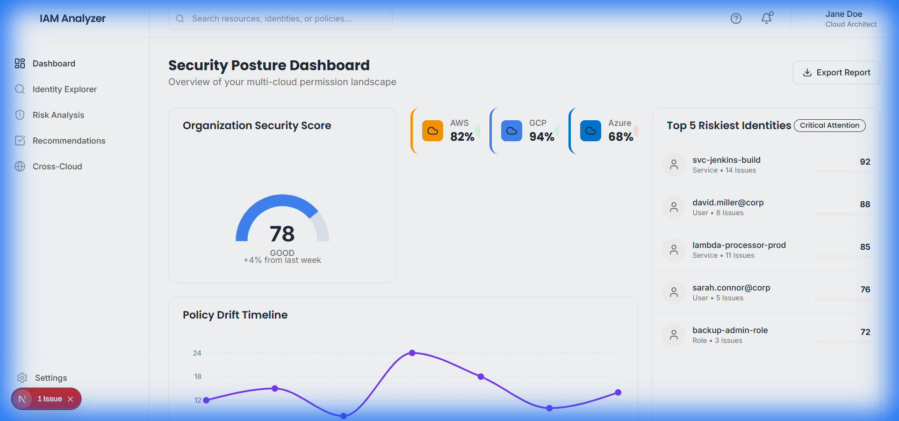
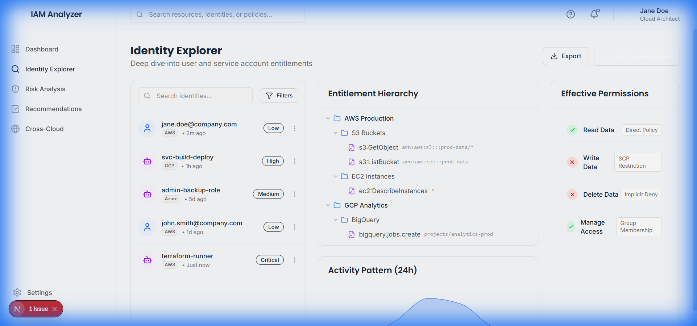
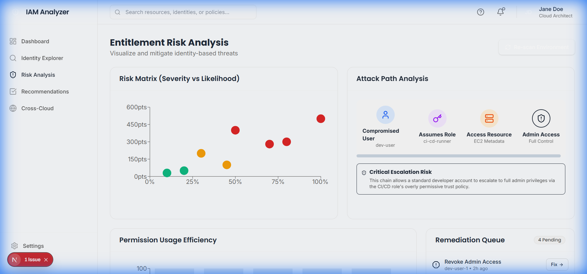
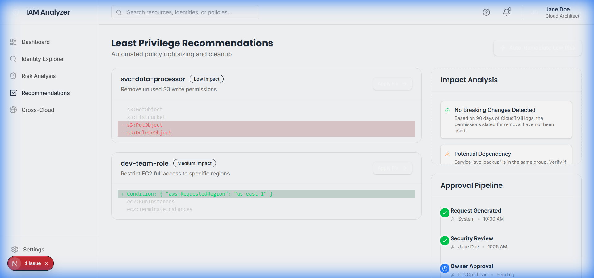

# ZeroTrust IAM Analyzer - Frontend Walkthrough

New React/Next.js frontend for ZeroTrust IAM Analyzer, designed with a "Permissions Microscope" concept for CIEM (Cloud Infrastructure Entitlement Management).

## Technology Stack

- **Framework**: Next.js 16 with App Router
- **Styling**: Tailwind CSS v4 with custom theme
- **Charts**: Recharts for data visualization
- **Icons**: Lucide React
- **Fonts**: Inter (UI) + Roboto Mono (data)

## Design System

### Color Palette
| Color | Hex | Usage |
|-------|-----|-------|
| Google Blue | #4285F4 | Primary actions |
| Deep Purple | #7C3AED | Governance, authority |
| Off-white | #F8FAFC | Background |
| Charcoal | #1F2937 | Emphasis panels |
| Vermillion | #DC2626 | High risk |
| Orange | #F59E0B | Medium risk |
| Green | #10B981 | Low risk |
| Slate Gray | #64748B | Secondary text |

### Design Language
- Material Design 3 influence
- Light mode with clean analytical feel
- Cards with subtle shadows and 16px rounded corners
- Breadcrumb navigation for permission hierarchies

## Screens

### 1. Security Posture Dashboard
- Organization security score gauge (0-100)
- Cloud provider breakdown (AWS/GCP/Azure cards)
- Top 5 riskiest identities
- Permission distribution treemap
- Drift detection timeline

### 2. Identity Explorer
- Searchable identity list with filters
- Identity cards (human vs service account badges)
- Permission tree with expandable hierarchy
- Effective permissions panel
- Usage analytics sparklines

### 3. Entitlement Risk Analysis
- Risk matrix scatter plot (severity vs likelihood)
- Privilege escalation paths flow diagram
- Unused permissions stacked bar chart
- Dangerous combinations detector
- Remediation queue

### 4. Least Privilege Recommendations
- Before/After diff view
- Impact analysis panel
- One-click Terraform generation
- Approval workflow pipeline
- Historical recommendations tracker

### 5. Cross-Cloud Visibility
- Unified identity view across clouds
- Permission comparison matrix
- Federated identity mapping
- Multi-cloud risk heatmap

## Screenshots

### Security Posture Dashboard


### Identity Explorer


### Risk Analysis


### Recommendations


## Running the Frontend

```bash
cd frontend
npm install
npm run dev
```

Visit http://localhost:3000

## Build

```bash
npm run build
```

## Next Steps

- Connect to real cloud provider APIs (AWS IAM, GCP IAM, Azure RBAC)
- Implement "One-Click Remediation" with Terraform generation
- Add authentication and role-based access control
- Integrate with SIEM for real-time policy drift alerts
